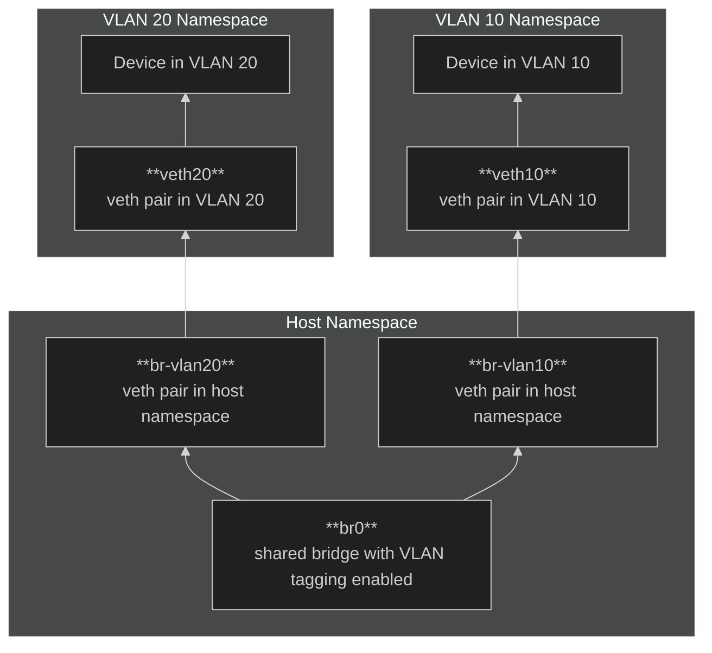

# Virtual Networking with Network Namespaces and VLANs

This guide demonstrates how to create isolated network environments
using Linux **network namespaces** and **VLANs**. By leveraging a
**VLAN-aware bridge**, enabling **NAT for internet connectivity**, and
employing **iptables for traffic control**, you can build a robust,
scalable virtual networking environment for testing and development.
This setup is especially useful for experimenting with software-defined
networking (SDN) concepts or building virtualized infrastructure.

## Network Structure

The diagram below illustrates the core components of the setup. Each
namespace is connected to the VLAN-aware bridge through virtual Ethernet
pairs (`veth`), with the bridge managing VLAN tagging and forwarding.



> [!NOTE]
> VLANs are isolated by default. Communication between them requires
> explicit routing configured on the host.

### Key Concepts

1. **VLANs**: Logical segmentation of Layer 2 networks using 802.1Q
   tagging.
2. **Network Namespaces**: Isolated virtual network stacks, similar to
   lightweight VMs or containers.
3. **VLAN-Aware Bridge**: A central point for traffic forwarding and
   VLAN tagging.
4. **NAT and iptables**: Tools for enabling internet connectivity and
   controlling inter-VLAN traffic.

## Step-by-Step Configuration

### Create Network Namespaces

Namespaces simulate isolated network environments.

```bash
ip netns add vlan10
ip netns add vlan20
```

### Create Virtual Ethernet Pairs

`veth` pairs act as virtual cables connecting namespaces to the host.

```bash
ip link add veth10 type veth peer name veth10-br
ip link add veth20 type veth peer name veth20-br
```

### Assign Interfaces to Namespaces

Move one end of each `veth` pair into its respective namespace.

```bash
ip link set veth10 netns vlan10
ip link set veth20 netns vlan20
```

### Configure Interfaces in Namespaces

Set IP addresses and activate the interfaces inside the namespaces.

```bash
ip netns exec vlan10 ip addr add 192.168.10.2/24 dev veth10
ip netns exec vlan10 ip link set dev veth10 up

ip netns exec vlan20 ip addr add 192.168.20.2/24 dev veth20
ip netns exec vlan20 ip link set dev veth20 up
```

> [!NOTE]  
> The IP addresses are examples. They represnt a device in VLAN 10 and
> VLAN 20, respectively.

### Set Up the VLAN-Aware Bridge

Create a VLAN-aware bridge with `vlan_filtering` enabled. Attach the
`veth` pairs to the bridge and configure VLAN IDs.

```bash
ip link add name br0 type bridge vlan_filtering 1
ip link set dev br0 up

ip link set veth10-br master br0
bridge vlan add dev veth10-br vid 10 pvid untagged

ip link set veth20-br master br0
bridge vlan add dev veth20-br vid 20 pvid untagged
```

> [!NOTE]  
> When configure pvid untagged, it generally assumes that the uplink is
> either sending untagged frames or doesn't require explicit VLAN
> tagging at the source. The bridge or subinterface then takes care of
> tagging based on the VLAN ID or other configurations.

### Enable NAT for Internet Access

NAT allows namespaces to access the internet by masquerading their
private IPs as the host's public IP.

1. Enable IP forwarding:

   ```bash
   echo 1 > /proc/sys/net/ipv4/ip_forward
   ```

2. Configure NAT with `iptables`:

   ```bash
   iptables -t nat -A POSTROUTING -o eth0 -j MASQUERADE
   ```

3. Allow traffic forwarding between namespaces and the internet:

   ```bash
   iptables -A FORWARD -i br0 -o eth0 -j ACCEPT
   iptables -A FORWARD -i eth0 -o br0 -m state --state RELATED,ESTABLISHED -j ACCEPT
   ```

### (Optional) Use a Reverse Proxy for Ingress

A reverse proxy, such as NGINX, can route external traffic to specific
namespaces based on hostnames.

```nginx
server {
    listen 80;
    server_name vlan10.example.com;

    location / {
        proxy_pass http://192.168.10.2;
    }
}

server {
    listen 80;
    server_name vlan20.example.com;

    location / {
        proxy_pass http://192.168.20.2;
    }
}
```

### Control Inter-VLAN Traffic

Use `iptables` to define explicit rules for allowing or blocking
inter-VLAN communication.

#### Allow Traffic Between VLANs

```bash
iptables -A FORWARD -i br0 -s 192.168.10.0/24 -d 192.168.20.0/24 -j ACCEPT
iptables -A FORWARD -i br0 -s 192.168.20.0/24 -d 192.168.10.0/24 -j ACCEPT
```

#### Block Traffic Between VLANs

```bash
iptables -A FORWARD -i br0 -s 192.168.10.0/24 -d 192.168.20.0/24 -j DROP
iptables -A FORWARD -i br0 -s 192.168.20.0/24 -d 192.168.10.0/24 -j DROP
```

## Verification

### Within VLANs

Ping the gateway from devices within the same VLAN.

```bash
ip netns exec vlan10 ping -c 3 192.168.10.1
```

### Across VLANs

Ping devices across VLANs to verify inter-VLAN routing (if allowed).

```bash
ip netns exec vlan10 ping -c 3 192.168.20.2
```

### Internet Access

Ensure namespaces can access the internet.

```bash
ip netns exec vlan10 curl http://example.com
```

## Summary

- **VLAN-Aware Bridge**: Centralizes VLAN tagging and simplifies
  management.
- **NAT**: Enables outbound internet connectivity for namespaces.
- **Reverse Proxy (Optional)**: Routes ingress traffic to specific
  namespaces.
- **Traffic Control**: Fine-grained control over inter-VLAN
  communication via `iptables`.
