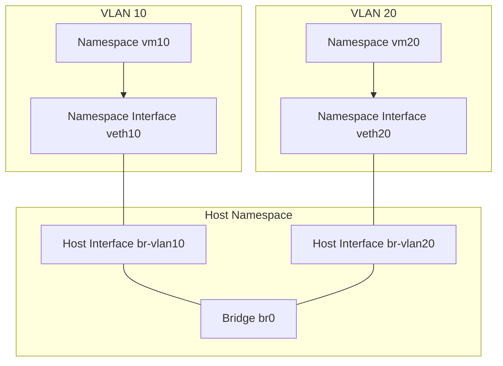

# VLAN Simulation with Linux Network Namespaces

This document provides a detailed guide on simulating VLANs using Linux
tools such as network namespaces (`netns`), virtual Ethernet pairs
(`veth`), and bridges. The objective is to replicate VLAN-based traffic
isolation and routing as they would function in physical or
software-defined networks (SDN).

## Network Structure

The diagram below illustrates the core components of the setup. Each
namespace is connected to the VLAN-aware bridge through virtual Ethernet
pairs (`veth`), with host-side interfaces managing the connections.



> [!NOTE]  
> **Isolation by Default**  
> VLANs are isolated from each other in this configuration.
> Communication between them requires explicit routing on the host.

## Overview of Components

## VLANs in Networking

- **Virtual Local Area Networks (VLANs)** logically segment Layer 2
  traffic within a shared network infrastructure.
- **802.1Q Tagging**: Adds VLAN IDs to packets, enabling logical
  separation even when using shared links.

## Linux Networking Tools

- **Namespaces**: Provide isolated network environments, similar to
  virtual machines or containers.
- **Virtual Ethernet Pairs**: Act as virtual cables connecting
  namespaces to the host.
- **Bridge**: Functions as a software switch, forwarding traffic between
  connected interfaces.

## Configuration Steps

## 1. Create Network Namespaces

Network namespaces simulate isolated environments for VLANs.

```bash
ip netns add vm10
ip netns add vm20
```

## 2. Create Virtual Ethernet Pairs

Each `veth` pair connects a namespace to the host.

```bash
ip link add veth10 type veth peer name br-vlan10
ip link add veth20 type veth peer name br-vlan20
```

## 3. Assign Interfaces to Namespaces

Move one end of each `veth` pair into the respective namespace.

```bash
ip link set veth10 netns vm10
ip link set veth20 netns vm20
```

## 4. Configure Interfaces in Namespaces

Assign IP addresses and activate the interfaces.

```bash
ip netns exec vm10 ip addr add 192.168.10.2/24 dev veth10
ip netns exec vm10 ip link set dev veth10 up

ip netns exec vm20 ip addr add 192.168.20.2/24 dev veth20
ip netns exec vm20 ip link set dev veth20 up
```

> [!TIP]  
> **Advanced Networking**  
> Consider replacing the Linux bridge with Open vSwitch (OVS) for more
> advanced VLAN and routing management.

## 5. Set Up the Bridge

Create a bridge in the host namespace to manage network traffic.

```bash
ip link add name br0 type bridge
ip link set dev br0 up
ip link set dev br-vlan10 master br0
ip link set dev br-vlan20 master br0
ip link set dev br-vlan10 up
ip link set dev br-vlan20 up
```

> [!NOTE]  
> **Bridge Functionality**  
> The bridge (`br0`) operates as a Layer 2 switch, enabling
> communication between connected interfaces.

## 6. Add VLAN Subinterfaces

Configure VLAN subinterfaces on the host for traffic tagging and
segregation.

```bash
ip link add link br-vlan10 name br-vlan10.10 type vlan id 10
ip link set dev br-vlan10.10 up

ip link add link br-vlan20 name br-vlan20.20 type vlan id 20
ip link set dev br-vlan20.20 up
```

## 7. Assign Gateway IPs

Set IP addresses on the VLAN subinterfaces to serve as gateways for
traffic.

```bash
ip addr add 192.168.10.1/24 dev br-vlan10.10
ip addr add 192.168.20.1/24 dev br-vlan20.20
```

> [!TIP]  
> **Dynamic Traffic Control**  
> Integrate an SDN controller to dynamically manage VLAN traffic and
> routing behaviors for large-scale setups.

## 8. Enable Routing

Allow communication between VLANs by enabling IP forwarding and adding
routes.

```bash
# Enable IP forwarding on the host
sysctl -w net.ipv4.ip_forward=1

# Add default routes in namespaces
ip netns exec vm10 ip route add default via 192.168.10.1
ip netns exec vm20 ip route add default via 192.168.20.1
```

## Verification

## Test Within VLANs

Ping the gateway from devices within the same VLAN to verify
connectivity.

```bash
ip netns exec vm10 ping -c 3 192.168.10.1
```

## Test Across VLANs

Ping devices across VLANs to verify inter-VLAN routing (if configured).

```bash
ip netns exec vm10 ping -c 3 192.168.20.2
```

## Summary

- **Bridge as a Central Hub**: The bridge (`br0`) manages and forwards
  traffic between connected interfaces.
- **Traffic Isolation**: VLANs remain isolated unless explicitly routed
  on the host.
- **Scalable Networking**: This setup provides a foundation for
  experimenting with VLANs and SDN in virtualized environments.
