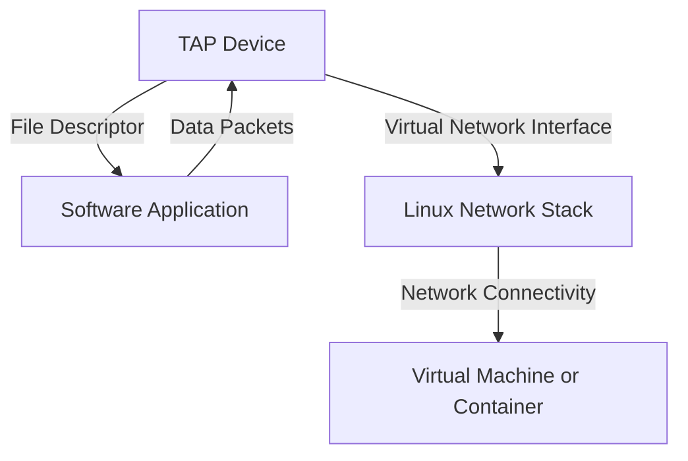

# Fun with TAP Devices

`TAP`, or *Terminal Access Points*, are virtual network devices that
operate at the link layer. They are used to create virtual network
interfaces capable of sending and receiving packets. TAP devices are
commonly used in virtualized environments, such as virtual machines or
containers, to provide network connectivity. They can also be used to
create virtual network interfaces for testing and development purposes.

## Interaction Explained



TAP devices bridge the gap between software applications and the Linux
network stack. The software interacts with the TAP device via a file
descriptor, sending and receiving packets. This virtual interface
enables virtual machines or containers to connect to the host network
stack.

## Creating a TAP Device

To create a TAP device, set it *up* and assign it an IP address:

```console
$ ip tuntap add dev tap0 mode tap

$ ip link set dev tap0 up

$ ip -br link show tap0
tap0             DOWN           4a:a9:c5:66:40:f0 <NO-CARRIER,BROADCAST,MULTICAST,UP>

$ ip addr add 192.168.0.10/24 dev tap0

$ ip -br addr show tap0
tap0             DOWN           192.168.0.10/24
```

The device is still showing as `DOWN` because it is in the
`<NO-CARRIER>` state. This occurs because it is not connected to
anything. A TAP device is not physically connected to the medium (i.e.,
the wire). Instead, Linux provides a way to obtain a file descriptor for
reading and writing packets to the device. On one end of this *cable* is
a Linux network interface with all its features, and on the other end is
a file descriptor meant for software interaction.

## Using a TAP File Descriptor

The example below is based on the [kernel
documentation](https://www.kernel.org/doc/html/latest/networking/tuntap.html).
It opens a file descriptor for an existing device (or creates a new
one). The `ip tuntap` command from earlier is actually a [wrapper around
`ioctl`
calls](https://github.com/iproute2/iproute2/blob/main/ip/iptuntap.c#L48)
like these.

### Obtaining the File Descriptor

```c
#include <fcntl.h>
#include <linux/if.h>
#include <linux/if_tun.h>
#include <stdio.h>
#include <string.h>
#include <sys/ioctl.h>
#include <unistd.h>

int open_sesame(const char *dev) {
  int fd = open("/dev/net/tun", O_RDWR);
  if (fd < 0) {
    perror("open /dev/net/tun");
    return -1;
  }

  struct ifreq ifr;
  memset(&ifr, 0, sizeof(ifr));

  ifr.ifr_flags = IFF_TAP | IFF_NO_PI;

  strncpy(ifr.ifr_name, dev, IFNAMSIZ);

  if (ioctl(fd, TUNSETIFF, &ifr) < 0) {
    perror("ioctl TUNSETIFF");
    close(fd);
    return -1;
  }

  return fd;
}
```

> [!NOTE]  
> The `IFF_NO_PI` flag is crucial because it disables the prepending of
> protocol information to the packets. Without this flag, the data read
> from the TAP device would include an extra header, which might not be
> expected by your application.

This function opens the `/dev/net/tun` device, which is a special file
providing access to the TAP/TUN driver. The `open` call returns a file
descriptor for reading and writing packets to the TAP device. The
`ioctl` call configures the TAP device, using the `TUNSETIFF` command to
set its interface flags. The `IFF_TAP` flag indicates that the device is
a TAP device.

```c
int main() {
  int tap = open_sesame("tap0");
  if (tap < 0) {
    perror("tun_alloc");
    return 1;
  }
  sleep(60);
  close(tap);
  return 0;
}
```

When this code is compiled and executed, the TAP device will show as
`UP` for as long as the file descriptor remains open. The device is
effectively connected to the *physical medium*, which, in reality, is
the program holding the open file descriptor.

```console
$ cc tap.c
$ ./a.out &
$ ip -br link show tap0
tap0             UP             4a:a9:c5:66:40:f0 <BROADCAST,MULTICAST,UP,LOWER_UP>
```

### Reading and Writing Ethernet Frames

Once the file descriptor is obtained, it can be used to read and write
Ethernet frames:

```c
void print_eth(const char *buf, int n) {

  struct ethhdr *eth = (struct ethhdr *)buf;

  char *mac_fmt = "%-14s %02x:%02x:%02x:%02x:%02x:%02x\n";

  printf(mac_fmt, "Source:", eth->h_source[0], eth->h_source[1],
         eth->h_source[2], eth->h_source[3], eth->h_source[4],
         eth->h_source[5]);

  printf(mac_fmt, "Destination:", eth->h_dest[0], eth->h_dest[1],
         eth->h_dest[2], eth->h_dest[3], eth->h_dest[4], eth->h_dest[5]);

  printf("%-14s", "Ethertype:");
  switch (ntohs(eth->h_proto)) {
  case ETH_P_IP:
    printf(" IPv4\n");
    break;
  case ETH_P_IPV6:
    printf(" IPv6\n");
    break;
  case ETH_P_ARP:
    printf(" ARP\n");
    break;
  default:
    printf(" 0x%04x\n", ntohs(eth->h_proto));
  }

  int len = n - sizeof(struct ethhdr);
  printf("Payload (%d bytes):\n  ", len);
  for (int i = 0; i < len; i++) {
    if (i % 16 == 0 && i != 0)
      printf("\n  ");
    printf("%02x ", (unsigned char)buf[i]);
  }

  printf("\n\n");
}
```

The `main` function can call this in a loop:

```c
int main() {
  int tap = open_sesame("tap0");
  if (tap < 0)
    return 1;

  char buf[2048];
  while (1) {
    int n = read(tap, buf, sizeof(buf));
    if (n < 0) {
      perror("read");
      close(tap);
      return 1;
    }
    print_eth(buf, n);
  }

  close(tap);
  return 0;
}
```

### Sending ARP Requests

Now that the program reads packets and prints them, try sending some
packets. Use `arping` to send ARP requests:

```bash
arping 192.168.0.10
```

The program will print the received packets:

```console
Received 58 bytes:
Source:        4a:a9:c5:66:40:f0
Destination:   ff:ff:ff:ff:ff:ff
Ethertype:     ARP
Payload (44 bytes):
  ff ff ff ff ff ff 4a a9 c5 66 40 f0 08 06 00 01
  08 00 06 04 00 01 4a a9 c5 66 40 f0 c0 a8 00 0a
  00 00 00 00 00 00 c0 a8 00 0a 00 00
```

## Cleanup

To remove the TAP device from the system, use the `ip` command:

```bash
ip link del dev tap0
```

## Conclusion

TAP devices are powerful tools for virtualization and testing. They
provide virtual network interfaces without requiring physical devices.
However, carrier logic must be implemented in software.
