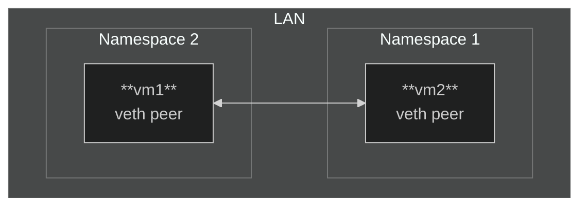
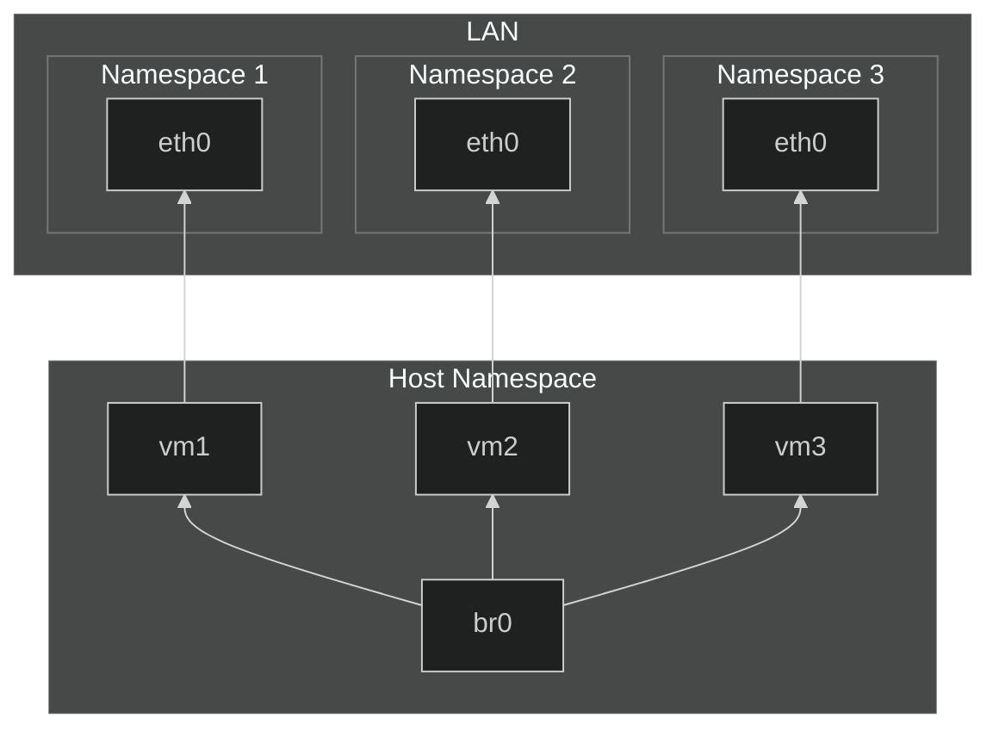
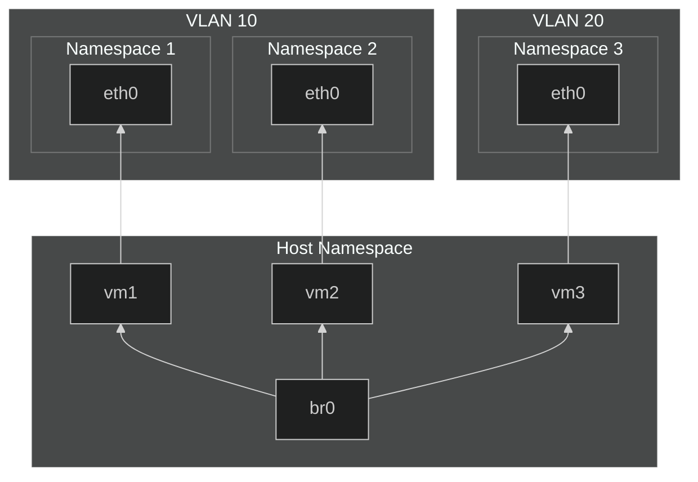

# Virtual Networking in Linux

Linux provides powerful tools for creating isolated, scalable, and
flexible virtual network environments. This guide demonstrates how to
use network namespaces, virtual Ethernet (veth) pairs, bridges, and
VLANs to construct and manage virtual networks.

> [!NOTE]  
> Ensure you have administrative (root) privileges to execute the
> commands provided in this guide.

The process is divided into three phases:

1. Establishing basic connectivity
2. Extending networks with bridges
3. Segregating traffic using VLANs

## Phase 1: Establishing Connectivity with veth Pairs



### Objective

Create two isolated namespaces (`vm1` and `vm2`) and connect them using
a virtual Ethernet (veth) pair.

### Network Namespaces and ARP

Network namespaces provide isolated networking stacks, each with its own
interfaces, routing tables, and ARP tables. ARP (Address Resolution
Protocol) maps IP addresses to MAC addresses in a local network by
broadcasting requests to all devices within the same Layer 2 domain.

### Implementation Steps

```bash
# Create namespaces
ip netns add vm1
ip netns add vm2

# Create a veth pair
ip link add veth1 type veth peer name veth2

# Assign interfaces to namespaces
ip link set veth1 netns vm1
ip link set veth2 netns vm2

# Activate interfaces
ip netns exec vm1 ip link set veth1 up
ip netns exec vm2 ip link set veth2 up

# Assign IP addresses
ip netns exec vm1 ip addr add 192.168.1.1/24 dev veth1
ip netns exec vm2 ip addr add 192.168.1.2/24 dev veth2
```

### Verifying Connectivity

```bash
# Ping from vm1 to vm2
$ ip netns exec vm1 ping -c 1 192.168.1.2
```

Expected output:

```console
PING 192.168.1.2 (192.168.1.2) 56(84) bytes of data.
64 bytes from 192.168.1.2: icmp_seq=1 ttl=64 time=0.045 ms
```

## Phase 2: Extending Connectivity with a Bridge



### Objective

Enable communication among multiple namespaces using a software-based
bridge (`br0`), which is a virtual Layer 2 switch implemented as a
kernel driver in Linux.

### What Is a Bridge?

A bridge in this context is a virtual network device that operates at
Layer 2 (Ethernet) and forwards frames between connected interfaces. It
dynamically learns MAC addresses and maintains a Forwarding Database
(FDB).

By emulating a physical switch, the bridge simplifies multi-namespace
setups, allowing interfaces (e.g., veth pairs) to communicate as if they
were connected to the same physical switch.

### Implementation Steps

```bash
# Delete existing veth pair
ip netns exec vm1 ip link del veth1

# Create a bridge
ip link add br0 type bridge
ip link set br0 up

# Create namespaces and veth pairs
ip netns add vm3
ip link add vm1 type veth peer name eth0 netns vm1
ip link add vm2 type veth peer name eth0 netns vm2
ip link add vm3 type veth peer name eth0 netns vm3

# Activate interfaces
ip link set vm1 up
ip link set vm2 up
ip link set vm3 up

# Assign IP addresses
ip netns exec vm1 ip addr add 192.168.0.1/24 dev eth0
ip netns exec vm2 ip addr add 192.168.0.2/24 dev eth0
ip netns exec vm3 ip addr add 192.168.0.3/24 dev eth0

# Attach interfaces to the bridge
ip link set vm1 master br0
ip link set vm2 master br0
ip link set vm3 master br0
```

### Verifying Functionality

```bash
ip netns exec vm1 ping -c 1 192.168.0.2
ip netns exec vm1 ping -c 1 192.168.0.3
```

Expected output for each ping:

```console
PING 192.168.0.x (192.168.0.x) 56(84) bytes of data.
64 bytes from 192.168.0.x: icmp_seq=1 ttl=64 time=0.045 ms
```

Monitor traffic:

```bash
$ tcpdump -i br0 -n
11:13:31.728611 ARP, Request who-has 192.168.0.2 tell 192.168.0.1, length 28
11:13:31.728661 ARP, Reply 192.168.0.2 is-at 66:f9:10:a9:3c:c8, length 28
11:13:31.728696 IP 192.168.0.1 > 192.168.0.2: ICMP echo request, id 397, seq 1, length 64
11:13:31.729368 IP 192.168.0.2 > 192.168.0.1: ICMP echo reply, id 397, seq 1, length 64
```

### Inspecting the FDB

The Forwarding Database (FDB) maps MAC addresses to forwarding
decisions, such as outgoing interfaces, the bridge itself, or
multicast/broadcast behavior. You can inspect FDB entries using the
`bridge fdb show` command. Below is an example output, truncated for
brevity:

```console
$ bridge fdb show br0
33:33:00:00:00:01 dev br0 self permanent
01:00:5e:00:00:6a dev br0 self permanent
33:33:00:00:00:6a dev br0 self permanent
01:00:5e:00:00:01 dev br0 self permanent
33:33:ff:c4:14:9e dev br0 self permanent
02:db:03:ed:2d:eb dev br0 vlan 1 master br0 permanent
02:db:03:ed:2d:eb dev br0 master br0 permanent
4a:00:1c:9f:99:69 dev vm1 vlan 10 master br0
ee:c7:78:4f:46:41 dev vm1 vlan 10 master br0 permanent
ee:c7:78:4f:46:41 dev vm1 vlan 1 master br0 permanent
ee:c7:78:4f:46:41 dev vm1 master br0 permanent
33:33:00:00:00:01 dev vm1 self permanent
01:00:5e:00:00:01 dev vm1 self permanent
33:33:ff:4f:46:41 dev vm1 self permanent
...
```

- **`dev`**: Specifies the device name associated with the MAC address.  

- **`self`**: Refers to entries that the bridge itself owns, including
  its own hardware MAC address.  

- **`permanent`**: Indicates that the entry is static and will not age
  out. These are system-generated or manually configured entries.  

- **`master`**: Represents the bridge interface that manages forwarding
  for the MAC address.  

- **`vlan`**: Denotes the VLAN ID associated with the MAC address.  

- **Dynamic Entries**: Entries not marked as `permanent` are dynamic and
  subject to aging out if unused within the aging timeout period.

> [!NOTE]  
> In the presented configuration, no MAC learning is taking place
> because all MAC addresses are either system-generated or explicitly
> configured. MAC learning would be relevant if access ports were
> connected to additional Layer 2 switches or bridges, where multiple
> MAC addresses might be learned dynamically on the same port.

#### Multicast Addresses

MAC addresses beginning with `33:33` are reserved for IPv6 multicast
traffic, while those starting with `01:00:5e` are reserved for IPv4
multicast traffic. These addresses cannot be assigned to individual
devices and are used exclusively for forwarding multicast frames.

## Phase 3: Traffic Segregation Using VLANs



### Objective

Segregate traffic using VLAN tagging. Assign namespaces (`vm1` and
`vm2`) to VLAN 10 and `vm3` to VLAN 20.

### What Is VLAN Tagging?

VLAN tagging (IEEE 802.1Q) allows logical network segmentation by
inserting VLAN IDs into Ethernet frames. A VLAN tag includes:

- **VLAN Identifier (VID)**: Specifies the VLAN (0–4095).
- **Priority Code Point (PCP)**: Used for QoS prioritization.
- **Drop Eligible Indicator (DEI)**: Indicates whether the frame can be
  dropped under congestion.

### Implementation Steps

```bash
ip link set dev br0 type bridge vlan_filtering 1

bridge vlan add dev vm1 vid 10 pvid untagged
bridge vlan add dev vm2 vid 10 pvid untagged
bridge vlan add dev vm3 vid 20 pvid untagged
```

The `vid` parameter specifies the VLAN ID, while `pvid` indicates the port's
default VLAN ID. The `untagged` option allows untagged frames to be sent and
received on the specified port.

This essentially means that VLAN tags are only known to the bridge. Tags are
added to frames as they enter the bridge through the ports and removed as they
exit.

These ports are configured as `access ports`, meaning they can only carry
traffic belonging to a single VLAN.

Alternatively, a port can be configured as a `trunk port`, which means the
bridge expects to receive tagged frames on this port. This configuration allows
the port to carry traffic from multiple VLANs through the same link. However,
the uplink switch must also be configured as a trunk port and must send tagged
frames for compatibility.

### Test connectivity

#### Test Connectivity: Intra-VLAN Communication

```bash
ip netns exec vm1 ping -c 1 192.168.0.2
```

Expected Success:

```console
PING 192.168.0.2 (192.168.0.2) 56(84) bytes of data.
64 bytes from 192.168.0.2: icmp_seq=1 ttl=64 time=0.045 ms
```

In this test, `vm1` and `vm2` belong to the same VLAN (VLAN 10), so the ping
should succeed, demonstrating that intra-VLAN communication is functional.

#### Test Connectivity: Inter-VLAN Communication

```bash
ip netns exec vm1 ping -c 1 192.168.0.3
```

Expected Failure:

```console
PING 192.168.0.3 (192.168.0.3) 56(84) bytes of data.
--- 192.168.0.3 ping statistics ---
1 packets transmitted, 0 received, 100% packet loss, time 0ms
```

In this test, `vm1` (VLAN 10) and `vm3` (VLAN 20) belong to different VLANs.
The ping should fail, demonstrating that inter-VLAN communication is blocked
unless explicitly routed or allowed.

### VLAN Configuration

The `bridge vlan show` command displays a table of VLAN IDs (VIDs) and
their associated ports, defining how communication is controlled.

```console
$ bridge vlan show
port              vlan-id
br0               1 PVID Egress Untagged
vm1               1 Egress Untagged
                  10 PVID Egress Untagged
vm2               1 Egress Untagged
                  10 PVID Egress Untagged
vm3               1 Egress Untagged
                  20 PVID Egress Untagged
```

In this configuration, ports `vm1` and `vm2` are part of VLAN 10, while
`vm3` is part of VLAN 20. Frames tagged with a VLAN ID remain isolated
within their VLAN unless explicitly configured otherwise.

#### VLAN Filtering

When `vlan_filtering=0`, VLAN filtering is disabled, and all ports can
communicate without restrictions. VLAN configurations are ignored
entirely, meaning there is no separation of traffic based on VLAN IDs.

With `vlan_filtering=1`, VLAN filtering is enabled, and frames are
processed according to VLAN rules. By default, all ports belong to VLAN
ID 1 unless specific Port VLAN IDs (PVIDs) are configured.

PVIDs handle untagged traffic by tagging incoming untagged frames with
the assigned VLAN ID. Frames tagged with a VLAN ID can only exit through
ports that are part of the same VLAN unless explicitly permitted.

## Cleanup

Remove created namespaces and interfaces:

```bash
ip netns del vm1
ip netns del vm2
ip link del br0
```

Verify:

```bash
ip netns show
ip link show
```

## Potential Issues and Debugging

### Subnet Mismatches

Devices outside the same subnet may broadcast ARP requests but fail
resolution if the subnet masks are incompatible.

### MTU Mismatches

Packet fragmentation or drops occur if MTU sizes differ. Adjust MTU as
needed:

```bash
ip link set dev veth1 mtu 1400
```

### IP Overlap

Namespaces with identical IPs remain isolated unless explicitly
connected via a bridge or router.

## Applications

- **Container Networking**: Tools like Docker and Kubernetes use veth
  pairs and bridges.
- **Isolated Testing**: Developers create isolated environments for
  testing.
- **Cloud Datacenters**: VLANs and bridges segregate tenant traffic
  securely.

## Summary

This guide covered:

- Creating isolated namespaces using veth pairs.
- Extending connectivity with bridges.
- Segregating traffic using VLANs.

These techniques enable scalable, isolated, and efficient virtual
networks tailored to various needs.
