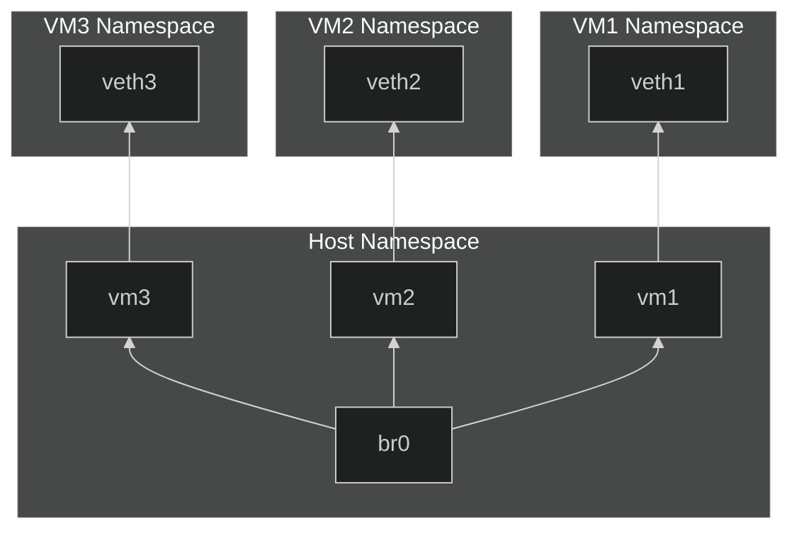

# Virtual Network Topology

In this document, we will explore how to create a virtual network
topology using network namespaces and virtual Ethernet (veth) pairs.
This setup is useful for isolating network traffic, testing network
configurations, and simulating complex network environments.



## Linking Network Namespaces with Veth Pairs

This is one of the most basic setups. It directly connects two network
namespaces using a veth pair. Each end of the veth pair is assigned to a
different network namespace. This allows for direct communication
between the two namespaces.

Since this operates on the link layer, the addresses of the veth
interfaces need to be in the same broadcast domain.

```console
$ ip netns add vm1
$ ip netns add vm2

$ ip link add veth1 type veth peer veth2
$ ip link set veth1 netns vm1
$ ip link set veth2 netns vm2

$ ip netns exec vm1 ip link set lo up
$ ip netns exec vm1 ip link set veth1 up

$ ip netns exec vm2 ip link set lo up
$ ip netns exec vm2 ip link set veth2 up

$ ip netns exec vm1 ip addr add 192.168.1.10/24 dev veth1
$ ip netns exec vm2 ip addr add 192.168.1.20/24 dev veth2

# in one terminal
$ ip netns exec vm2 tcpdump -i veth2 arp
listening on veth2, link-type EN10MB (Ethernet), snapshot length 262144 bytes
21:23:20.594131 ARP, Request who-has 192.168.1.20 tell 192.168.1.10, length 44
21:23:20.594147 ARP, Reply 192.168.1.20 is-at da:cf:52:fe:59:ef (oui Unknown), length 28

# in another terminal
$ ip netns exec vm1 arping -I veth1 192.168.1.20 -c 1
ARPING 192.168.1.20
42 bytes from da:cf:52:fe:59:ef (192.168.1.20): index=0 time=13.680 usec

--- 192.168.1.20 statistics ---
1 packets transmitted, 1 packets received,   0% unanswered (0 extra)
rtt min/avg/max/std-dev = 0.014/0.014/0.014/0.000 ms
```

Before the next step, remove both network namespaces and the vethpair.

```console
ip netns del vm1
ip netns del vm2
```

## Using a shared bridge

In this setup, the network spaces are connected to a central bridge.
This is suitable for more complex topologies where multiple devices
need to communicate with each other. The bridge acts as a switch,
allowing all connected devices to communicate.

Like in the previous example, the addresses of the veth interfaces need
to be in the same broadcast domain, since this is still purely a link
layer setup.

```console
$ ip netns add vm1
$ ip netns add vm2

$ ip link add vm1 type veth peer veth1
$ ip link add vm2 type veth peer veth2

$ ip link set veth1 netns vm1
$ ip link set veth2 netns vm2

$ ip link add br0 type bridge
$ ip link set vm1 master br0
$ ip link set vm2 master br0

$ ip netns exec vm1 ip addr add 192.168.0.10/24 dev veth1
$ ip netns exec vm2 ip addr add 192.168.0.20/24 dev veth2

$ ip netns exec vm1 ip link set veth1 up
$ ip netns exec vm2 ip link set veth2 up

$ ip link set vm1 up
$ ip link set vm2 up
$ ip link set br0 up

$ ip netns exec vm1 arping -I veth1 192.168.0.20 -c 1
ARPING 192.168.0.20
42 bytes from 16:bc:f1:c0:81:c0 (192.168.0.20): index=0 time=15.307 usec

--- 192.168.0.20 statistics ---
1 packets transmitted, 1 packets received,   0% unanswered (0 extra)
rtt min/avg/max/std-dev = 0.015/0.015/0.015/0.000 ms
```

This time, keep the network namespaces and the bridge, as the next step will
expand on this setup.

## Using VLAN tags to isolate traffic

If only some but not all devices on a bridge should be able to
communicate, VLAN tags can be used to isolate traffic. This is
especially useful in a shared environment where multiple tenants operate
on the same physical hardware. VLAN tags are used to distinguish between
different tenants, allowing for isolation of traffic. This is a Layer 2
solution, so the IP addresses of the veth interfaces need to be in the
same broadcast domain.

We add an extra vm to the previous example, and use VLAN tags to isolate
the traffic between the vms. vm1 and vm2 will be able to communicate
with each other but not with vm3.

```console
ip netns add vm3
ip link add vm3 type veth peer veth3
ip link set veth3 netns vm3
ip link set veth3 master br0
ip netns exec vm3 ip addr add 192.168.0.30/24 dev veth3
ip netns exec vm3 ip link set veth3 up
ip link set vm3 up
```

Configure VLAN aware bridge and set vlan ids for the vms.

```console
ip link set dev br0 type bridge vlan_filtering 1
bridge vlan del dev vm1 vid 10 pvid untagged
bridge vlan del dev vm2 vid 10 pvid untagged
bridge vlan del dev vm3 vid 20 pvid untagged
````

Ping between vm1 and vm2 still works, but pinging vm3 fails.

```console
$ ip netns exec vm1 ping -I veth1 192.168.0.20 -c 1
PING 192.168.0.20 (192.168.0.20) from 192.168.0.10 veth10: 56(84) bytes of data.
64 bytes from 192.168.0.20: icmp_seq=1 ttl=64 time=0.724 ms

--- 192.168.0.20 ping statistics ---
1 packets transmitted, 1 received, 0% packet loss, time 0ms
rtt min/avg/max/mdev = 0.724/0.724/0.724/0.000 ms

$ ip netns exec vm1 ping -I veth1 192.168.0.30 -c 1
PING 192.168.0.30 (192.168.0.30) from 192.168.0.10 veth10: 56(84) bytes of data.

--- 192.168.0.30 ping statistics ---
1 packets transmitted, 0 received, 100% packet loss, time 0ms
```
